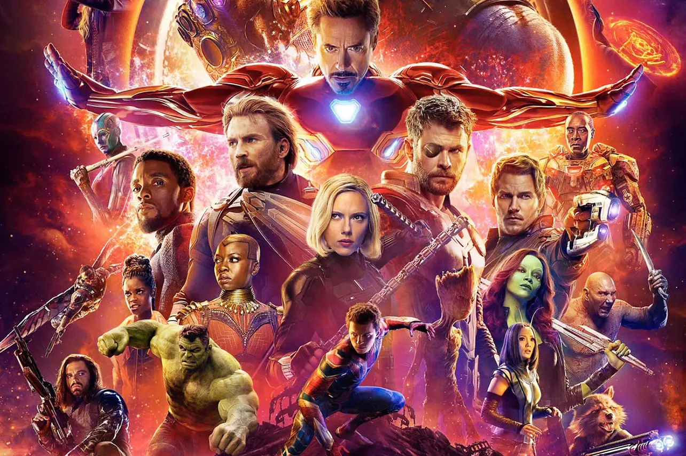

## MARVEL CHARACTER RANKING

This application lets users rank their favorite Marvel characters in a dynamic and interactive list. Users can like characters to boost their ranking to the top or dislike and remove them from the list. It’s a fun and engaging way to showcase your favorite heroes and villains from the Marvel universe!

# 💻 Tech Stack
<!-- Badges from https://github.com/Ileriayo/markdown-badges -->

